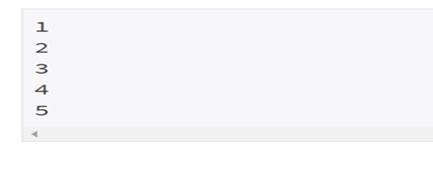

Algorithms
==========

Q1. Sorting Algorithms
----------------------

**Q1)  Given N numbers, write a code that sorts them in ascending order.**

**[Input]**

- The first line of input contains the N (1≤N≤1000). 
- Numbers are starting from the second line. 
- This number is an integer whose absolute value is less than or equal to 1000. 
- The numbers do not overlap.

**[Output]**

- Print the results sorted in ascending order from the first line to N lines; that is, one per line.

*Example: Input*                                          

*Example: Output*

Q2. Fibonacci Algoritm
----------------------

Q2) Fibonacci numbers start with 0 and 1. The 0th Fibonacci number is 0 and the 1st Fibonacci 
    
   number is 1. The following is the sum of the two previous Fibonacci numbers. 
    
   **That is, Fn=Fn-1+ Fn-2 (n≥2).**
    
   

   For example, when 2 ≤ n ≤ 17, Fibonacci numbers are,

   0, 1, 1, 2, 3, 5, 8, 13, 21, 34, 55, 89, 144, 233, 377, 610, 987, 1597

   When n is given, write a code to obtain the nth Fibonacci number.

  **[Input]**
  - n is given on the first line and the n is a natural number less than or equal to 45. 

  **[Output]** 
  - Print the nth Fibonacci number in the first line.
  
  *Example: I/O*
  
  
  
Q3. Algortihms for Prime Nuber 
------------------------------

Q3) When M and N are the natural numbers, select all of the prime numbers greater than or equal to M and less than or equal to N.
    
   Write a code to find the sum and the minimum value of these prime numbers. 

   For example, in case of M=60 and N=100, the prime numbers are 61, 67, 71, 73, 79, 83, 89, 97.
   
   Therefore, the sum of these prime numbers is 620, and the minimum value is 61. 

**[Input]**

- M is given on the first line, and N is given on the second line.
- M and N are natural numbers less than 10,000 and M is equal to or less than N.

**[Output]**
 
 Find all of the prime numbers greater than or equal to M and less than or equal to N, 
 
 and print the sum to the first line and the minimum value to the second line.
 
 However, if there is no prime number greater than or equal to M and less than or equal to N, print -1 on the first line.

*Example: I/O*

Q4. Algorithms for filling array in snail shape
-----------------------------------------------

Q4) 

*Example: I/O*

